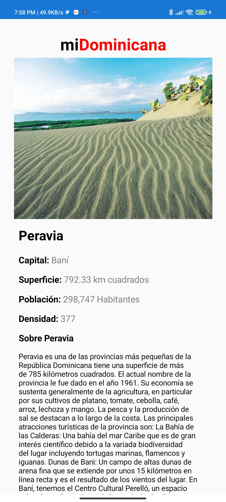

# MI DOMINICANA APP

MI Dominicana App is an App made By Dominicans where you cans seee the price of the fueels, currencies and a little decription about every province. This es the first step so I'll working to have the complete app 
## Screenshots / Mi Dominicana APP

    

## Tools used

- **NETStandar.Library** - A set of standard .NET APIs that are prescribed to be used and supported together.
<https://dotnet.microsoft.com/>

- **PropertyChanged.Fody** - Add property notification to all classes that implement INotifyPropertyChanged.
<https://github.com/Fody/PropertyChanged>

- **Xamarin.CommunityToolkit** - The Xamarin Community Toolkit is a collection of Animations, Behaviors, Converters, and Effects for mobile development with Xamarin.Forms. It simplifies and demonstrates common developer tasks building iOS, Android, and UWP apps with Xamarin.Forms.
<https://github.com/xamarin/XamarinCommunityToolkit>

- **Xamarin.Essentials** -  Essential cross platform APIs for yout mobile apps. https://github.com/xamarin/Essentials
<https://github.com/xamarin/Essentials>

- **Xamarin.Forms** - Build native UIs for iOS, ANdroid, UWP, macOS, Tizen and manu more from a single, shared C# codebase.
<https://github.com/xamarin/Xamarin.Forms>
